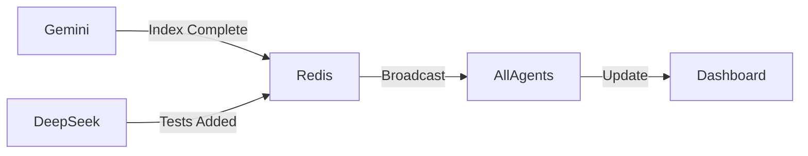

# 🚀 ASEMB Multi-Agent Coordination Guide

## Quick Start for Completing Phase 3

### 1. **Start Agent Coordinator**
```bash
# In terminal 1 - Start monitoring
node sync-agents.mjs

# In terminal 2 - Open dashboard
start dashboard/agent-monitor.html
```

### 2. **Agent-Specific Commands**

#### 🌟 Gemini (Performance)
```bash
# Create indexes
psql -U asemb_user -d asemb -f .gemini/create-indexes.sql

# Run benchmarks
npm run benchmark:hybrid-search

# Test cache integration
npm test -- cache-manager.test.ts
```

#### 🎨 DeepSeek (Testing & Docs)
```bash
# Add test:coverage script first
npm pkg set scripts.test:coverage="jest --coverage --passWithNoTests"

# Run coverage
npm run test:coverage

# Generate coverage report
npm run test:coverage -- --coverageReporters=html

# Update docs
node scripts/update-docs.js
```

### 3. **Parallel Execution Strategy**

Since the tasks are mostly independent, work on them simultaneously:

**Terminal Setup:**
- Terminal 1: Gemini - Database indexes
- Terminal 2: DeepSeek - Test coverage
- Terminal 3: Monitor - sync-agents.mjs
- Terminal 4: Git operations

### 4. **Communication Flow**



### 5. **Task Dependencies**

```yaml
Gemini:
  1. Create Indexes: No dependencies ✅
  2. Cache Integration: Depends on indexes
  3. Benchmarks: Depends on cache

DeepSeek:
  1. Test Coverage: No dependencies ✅
  2. Update Status: Depends on tests
  3. Production Guide: No dependencies ✅
```

### 6. **Quick Status Check**

```bash
# Check Redis for current status
redis-cli -n 2
> KEYS asemb:phase3:*
> HGETALL asemb:phase3:tasks:gemini:hybrid-indexes
> GET asemb:phase3:progress

# Check test coverage
npm test -- --coverage --silent

# Check git status
git status
```

### 7. **Completion Checklist**

- [ ] All PostgreSQL indexes created
- [ ] Redis cache integrated with search
- [ ] Performance benchmarks > targets
- [ ] Test coverage >= 80%
- [ ] PROJECT_STATUS.md updated
- [ ] PRODUCTION_SETUP.md created
- [ ] All changes committed and pushed

### 8. **Emergency Coordination**

If agents get out of sync:
```bash
# Reset task status in Redis
redis-cli -n 2 FLUSHDB

# Re-initialize
node sync-agents.mjs --reset

# Force sync
git pull --rebase origin main
git push --force-with-lease
```

### 9. **Performance Targets to Verify**

```javascript
// Expected metrics after completion
{
  searchLatency: "< 50ms",
  cacheHitRate: "> 80%",
  testCoverage: ">= 80%",
  concurrentQueries: "100 QPS",
  batchProcessing: "500 docs/sec"
}
```

### 10. **Final Validation**

```bash
# Run all tests
npm test

# Check build
npm run build

# Verify n8n integration
cd ~/.n8n/custom
npm link n8n-nodes-alice-semantic-bridge
n8n start

# Test workflow
# Import example-workflow.json and run
```

## 🎯 Time Estimate

With parallel execution:
- Gemini tasks: ~2 hours
- DeepSeek tasks: ~2 hours
- Integration & validation: ~1 hour
- **Total: ~3 hours to complete Phase 3**

## 💡 Pro Tips

1. **Keep terminals visible** - Use Windows Terminal with split panes
2. **Commit frequently** - Every completed subtask
3. **Update dashboard** - Log progress for visualization
4. **Ask for help** - If blocked, update Redis with blocker

---

**Let's complete this final 25% efficiently! 🚀**
