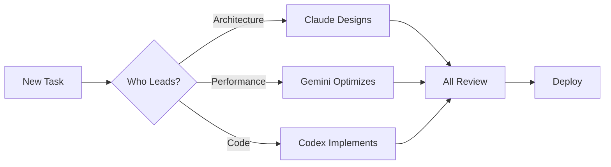

# 🚀 Alice Semantic Bridge - Quick Start Guide

## 📌 For All Agents: START HERE!

This guide helps Claude, Gemini, and Codex quickly understand and start working on the Alice Semantic Bridge project.

## 🎯 What is Alice Semantic Bridge?

**One Sentence**: A N8N community node that enables semantic search across multiple data sources (Google Docs, PostgreSQL, Web) with a visual dashboard for management.

**Key Point**: This is a **multi-agent collaborative project** where three AI agents work together using shared memory (Redis + ASB CLI).

## 👥 Who Does What?

| Agent | Role | First Task |
|-------|------|------------|
| **Claude** | CTO - Architecture & Security | Design database schema with pgvector |
| **Gemini** | Performance Engineer | Design chunking & search algorithms |
| **Codex** | Implementation Lead | Create N8N node structure |

## 🏃 Quick Start Commands

```bash
# 1. Every agent starts here
asb project switch alice-semantic-bridge

# 2. Check what others are doing
agent_context all

# 3. See project structure
asb file list

# 4. Read the main instructions
asb file read PROJECT_INSTRUCTIONS.md

# 5. Read your specific instructions
asb file read .claude/CLAUDE_INSTRUCTIONS.md  # For Claude
asb file read .gemini/GEMINI_INSTRUCTIONS.md  # For Gemini
asb file read .codex/CODEX_INSTRUCTIONS.md    # For Codex
```

## 📁 Project Structure Overview

```
alice-semantic-bridge/
├── packages/
│   ├── n8n-node/        # N8N custom node (Codex implements)
│   ├── dashboard/       # Next.js UI (All collaborate)
│   └── shared/          # Shared code (Codex maintains)
├── .claude/             # Claude's workspace
├── .gemini/             # Gemini's workspace
├── .codex/              # Codex's workspace
└── PROJECT_INSTRUCTIONS.md  # Master instructions
```

## 🔄 Collaboration Flow



## 📝 Today's Priority Tasks

### Morning Session (All Agents)
1. **Setup Check** ✅
   ```bash
   asb project current  # Should show: alice-semantic-bridge
   ```

2. **Database Design** (Claude leads)
   ```sql
   -- Claude: Design these tables
   CREATE TABLE sources (...);
   CREATE TABLE embeddings (...);
   CREATE TABLE chunks (...);
   ```

3. **Algorithm Design** (Gemini leads)
   ```typescript
   // Gemini: Optimize chunking
   interface ChunkStrategy {
     size: number;
     overlap: number;
   }
   ```

4. **Node Structure** (Codex leads)
   ```typescript
   // Codex: Create N8N node
   export class AliceSemanticBridge implements INodeType {
     // Implementation
   }
   ```

### Afternoon Session (Collaborative)
1. Review morning work
2. Integrate components
3. Write tests
4. Update documentation

## 🛠️ Essential Commands for Today

```bash
# File Operations (ALWAYS use these)
asb file read <path>          # Read any file
asb file write <path> <code>  # Write any file
asb file list                 # See all files

# Communication
agent_broadcast "Working on: X"  # Tell others
agent_context <agent>            # Check their work
asb context development          # See all activity

# Testing
asb exec "npm test"            # Run tests
asb exec "npm run lint"        # Check code
```

## ⚡ Quick Architecture Decisions

These are already decided:
- **Database**: PostgreSQL with pgvector extension
- **Frontend**: Next.js 14 + TailwindCSS + shadcn/ui
- **API**: tRPC (for type safety)
- **N8N Node**: TypeScript + N8N SDK
- **Embeddings**: OpenAI primary, Cohere backup

## 🎨 Code Style Quick Rules

```typescript
// Always use TypeScript
interface Props {
  name: string;  // Always typed
}

// Always handle errors
try {
  await operation();
} catch (error) {
  logger.error('Safe message', { error });
}

// Always validate input
const schema = z.object({
  query: z.string().min(1),
});
```

## 📊 Success Metrics

| What | Target | Who Owns |
|------|--------|----------|
| Security | Zero vulnerabilities | Claude |
| Performance | <100ms queries | Gemini |
| Code Coverage | >80% | Codex |
| Documentation | 100% | Codex |

## 🚦 Status Check Commands

```bash
# Where are we?
asb context all --summary

# What needs doing?
asb exec "npm run todo"

# Any issues?
asb exec "npm run test"
```

## 🔥 Common Issues & Solutions

### "Can't find project"
```bash
asb project create alice-semantic-bridge
asb project switch alice-semantic-bridge
```

### "Redis not connected"
```bash
# Start Redis first
redis-server

# Then retry
asb project current
```

### "Don't know what to do"
```bash
# Check your instructions
asb file read .<agent>/INSTRUCTIONS.md

# Check others' work
agent_context all

# Ask for help
agent_broadcast "Need help with: X"
```

## 📚 Resources Hierarchy

1. **First**: Read your agent-specific instructions
2. **Second**: Check PROJECT_INSTRUCTIONS.md
3. **Third**: Review ASB_CLI_DOCUMENTATION.md
4. **Then**: Look at existing code in packages/

## 🎯 End of Day Goals

By end of today, we should have:
- [ ] Database schema designed (Claude)
- [ ] Chunking algorithm specified (Gemini)
- [ ] N8N node skeleton created (Codex)
- [ ] Basic project structure working
- [ ] All agents synchronized via ASB

## 💬 Communication Protocol

```bash
# Start of work
agent_broadcast "Starting work on: <task>"

# When stuck
agent_broadcast "Blocked by: <issue>"

# When done
agent_broadcast "Completed: <task>"

# Need review
agent_broadcast "Ready for review: <component>"
```

## 🏁 Let's Start!

```bash
# Each agent run this now:
asb project switch alice-semantic-bridge
agent_broadcast "Agent <name> ready to work!"
agent_context all

# Then read your instructions:
asb file read .<your-agent-folder>/*_INSTRUCTIONS.md

# Start your first task!
```

---

**Remember**: 
- Use ASB CLI for EVERYTHING
- Communicate frequently
- Check others' work
- Follow your role
- Ask when unsure

**Let's build something amazing together! 🚀**
