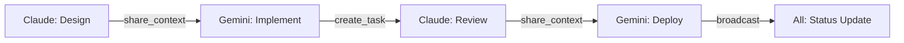

# 🚀 Alice Semantic Bridge - Multi-Agent Project Start

## ✅ Agent Setup Status

### Claude (CTO & System Architect) 
- **MCP:** ✅ Configured with asb-cli
- **Status:** ACTIVE
- **Ready to:** Review architecture, coordinate team

### Gemini (Senior Full-Stack Developer)
- **MCP:** ✅ Configured with asb-cli  
- **Status:** CONFIGURING
- **Ready to:** Implement features, handle DevOps

### Codex (DevOps & Automation)
- **MCP:** 🔧 Setting up
- **Status:** OFFLINE (needs setup)
- **Note:** Tasks temporarily handled by Gemini

## 📋 Project Context Files

Each agent should review these files:

### Essential Reading
1. `README.md` - Project overview
2. `AGENT_ROLES_V2.1.md` - Current team roles and responsibilities
3. `PROJECT_STATUS.md` - Current project state
4. `docs/ASB_ARCHITECTURE.md` - System architecture

### Technical Specs
1. `shared/asb-memory.js` - Shared memory implementation
2. `mcp.js` - MCP integration
3. `asb-orchestrator.js` - Task orchestration

## 🎯 First Tasks for Agents

### Claude - Architecture Review
```
1. Review shared/asb-memory.js for architecture compliance
2. Check if API design follows best practices
3. Create improvement tasks for team
4. Share architecture insights via MCP
```

### Gemini - Implementation Check
```
1. Review current codebase status
2. Check test coverage
3. Identify optimization opportunities  
4. Prepare deployment pipeline (covering for Codex)
```

### Codex - When Available
```
1. Set up CI/CD pipeline
2. Configure monitoring
3. Automate deployment process
4. Create infrastructure templates
```

## 💬 Agent Communication Protocol

### Starting a Session
```javascript
// Each agent announces presence
/mcp call asb-cli share_context key="agent:claude:status" value={"status": "online", "ready": true}

// Get project context
/mcp call asb-cli get_context key="project"
/mcp call asb-cli get_context key="agent-roles-v2.1"

// List other agents
/mcp call asb-cli list_agents
```

### Task Coordination
```javascript
// Claude creates task
/mcp call asb-cli create_task type="implementation" description="Add user authentication" priority="high"

// Gemini picks up task
/mcp call asb-cli get_context key="active-tasks"
/mcp call asb-cli share_context key="task:123:status" value={"status": "in-progress", "agent": "gemini"}

// Share progress
/mcp call asb-cli broadcast_message message="Authentication module 50% complete"

// Request review
/mcp call asb-cli create_task type="code-review" description="Review auth module" priority="high"
```

### Code Review Flow
```javascript
// Gemini completes feature
/mcp call asb-cli share_context key="feature:auth" value={"status": "ready-for-review", "branch": "feature/auth"}

// Claude reviews
/mcp call asb-cli get_context key="feature:auth"
// ... reviews code ...
/mcp call asb-cli share_context key="review:auth" value={"status": "approved", "comments": [...]}

// Gemini deploys
/mcp call asb-cli share_context key="deployment:auth" value={"status": "deploying", "target": "staging"}
```

## 🔄 Workflow Example



## 📊 Current Project Priorities

1. **HIGH:** Complete MCP integration for all agents
2. **HIGH:** Establish agent communication patterns
3. **MEDIUM:** Build real-time activity dashboard
4. **MEDIUM:** Improve semantic search
5. **LOW:** Documentation updates

## 🎮 Quick Test Commands

### For Claude
```bash
# In Claude Code
/mcp call asb-cli project_status
/mcp call asb-cli list_agents
/mcp call asb-cli share_context key="architecture:review" value={"status": "starting"}
```

### For Gemini
```bash
# In Gemini CLI
/mcp call asb-cli get_context key="architecture:review"
/mcp call asb-cli create_task type="implementation" description="Build dashboard UI"
```

### For Codex (when ready)
```bash
# In Codex CLI
/mcp call asb-cli share_context key="ci-cd:status" value={"pipeline": "ready"}
/mcp call asb-cli create_task type="deployment" description="Deploy to production"
```

## ⚡ Start Coordination

1. **All agents read this file**
2. **Review AGENT_ROLES_V2.1.md**
3. **Check project status via MCP**
4. **Begin assigned tasks**
5. **Communicate via shared context**

## 🔗 Shared Memory Keys

Important context keys to monitor:
- `project` - Project configuration
- `agent-roles-v2.1` - Current role definitions  
- `active-tasks` - Current task queue
- `performance-metrics` - System metrics
- `architecture:*` - Architecture decisions
- `feature:*` - Feature status
- `deployment:*` - Deployment status

---
**Let's build together! 🚀**
