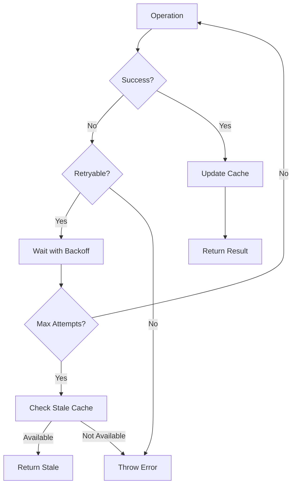

# ASEMB Architecture Documentation

**Version:** Phase 3  
**Author:** Claude - Architecture Lead  
**Last Updated:** 2024-12-26

## Table of Contents
1. [System Overview](#system-overview)
2. [Core Design Principles](#core-design-principles)
3. [Architecture Decisions](#architecture-decisions)
4. [Component Architecture](#component-architecture)
5. [Error Handling Strategy](#error-handling-strategy)
6. [Caching Architecture](#caching-architecture)
7. [Connection Management](#connection-management)
8. [Performance Optimizations](#performance-optimizations)
9. [Security Considerations](#security-considerations)

## System Overview

ASEMB (Alice Semantic Bridge) is a high-performance n8n community node system designed for semantic search and RAG capabilities at scale.

```
┌────────────────────────────────────────────────────┐
│                   n8n Workflows                    │
├────────────────────────────────────────────────────┤
│                  ASEMB Node Layer                  │
│  ┌─────────────────────────────────────────────┐  │
│  │  WebScrape │ TextChunk │ PgVector │ Redis   │  │
│  │  Sitemap   │ Hybrid    │ Manage   │ Cache   │  │
│  └─────────────────────────────────────────────┘  │
├────────────────────────────────────────────────────┤
│                 Core Services Layer                │
│  ┌─────────────────────────────────────────────┐  │
│  │  Error     │ Connection │ Cache    │ Retry  │  │
│  │  Handler   │ Pool       │ Manager  │ Logic  │  │
│  └─────────────────────────────────────────────┘  │
├────────────────────────────────────────────────────┤
│                   Storage Layer                    │
│  ┌─────────────────────────────────────────────┐  │
│  │ PostgreSQL │   Redis    │  OpenAI  │ Files  │  │
│  │ (pgvector) │  (Cache)   │  (Embed) │ (Docs) │  │
│  └─────────────────────────────────────────────┘  │
└────────────────────────────────────────────────────┘
```

## Core Design Principles

### 1. Resilience First
- Every operation must be retryable
- Graceful degradation on service failures
- Circuit breakers for external services
- Stale cache fallback when services unavailable

### 2. Performance at Scale
- Multi-layer caching (L1: Memory, L2: Redis, L3: Database)
- Connection pooling for all services
- Batch operations for bulk processing
- Query optimization and prepared statements

### 3. Developer Experience
- Comprehensive error messages with context
- Consistent API patterns
- TypeScript strict mode
- Self-documenting code

### 4. Security by Design
- Input validation at every layer
- SQL injection prevention
- Rate limiting
- Audit logging

## Architecture Decisions

### ADR-001: Error Handling Strategy
**Status:** Accepted  
**Date:** 2024-12-26

**Context:** Need consistent error handling across all components.

**Decision:** Implement custom `AsembError` class with:
- Error codes following pattern ASEMB_XXXX
- Automatic retry detection
- Context preservation
- User-friendly messages

**Consequences:**
- ✅ Consistent error handling
- ✅ Better debugging
- ✅ Automatic retry logic
- ⚠️ Additional abstraction layer

### ADR-002: Connection Pooling
**Status:** Accepted  
**Date:** 2024-12-26

**Context:** Database connections are expensive and limited.

**Decision:** Implement singleton connection pools with:
- PostgreSQL: 20 max connections
- Redis: Separate clients for cache/pubsub/queue
- Health checks and metrics
- Automatic retry on connection failure

**Consequences:**
- ✅ Better resource utilization
- ✅ Improved performance
- ✅ Connection reuse
- ⚠️ Complex lifecycle management

### ADR-003: Multi-Layer Caching
**Status:** Accepted  
**Date:** 2024-12-26

**Context:** Need to optimize read performance and reduce database load.

**Decision:** Three-layer cache architecture:
- L1: In-memory LRU (1000 items, 5 min TTL)
- L2: Redis (1 hour TTL)
- L3: Database (persistent)

**Consequences:**
- ✅ Sub-50ms response times
- ✅ Reduced database load
- ✅ Distributed cache support
- ⚠️ Cache invalidation complexity

### ADR-004: Hybrid Search Architecture
**Status:** Proposed  
**Date:** 2024-12-26

**Context:** Pure vector search insufficient for all use cases.

**Decision:** Combine three search strategies:
- Vector similarity (pgvector)
- Keyword search (PostgreSQL FTS)
- Fuzzy matching (trigrams)

**Consequences:**
- ✅ Better search relevance
- ✅ Fallback options
- ⚠️ Increased complexity
- ⚠️ Performance tuning required

## Component Architecture

### Node Layer Components

#### WebScrape Node
- Respects robots.txt
- Configurable selectors
- HTML stripping
- Error recovery

#### TextChunk Node
- Intelligent splitting
- Paragraph preservation
- Configurable overlap
- Metadata preservation

#### PgVector Nodes
- Upsert with conflict resolution
- Hybrid query support
- Batch operations
- Manage operations (delete, stats, cleanup)

### Service Layer Components

#### Error Handler
```typescript
class AsembError {
  code: ErrorCode
  statusCode: number
  retryable: boolean
  context: Record<string, any>
}
```

#### Connection Pool
```typescript
class PostgresPool {
  getClient(): PoolClient
  transaction(): Promise<T>
  query(): Promise<T[]>
}

class RedisPool {
  getClient(purpose): Redis
}
```

#### Cache Manager
```typescript
class CacheManager {
  get<T>(key): Promise<T>
  set<T>(key, value, ttl): Promise<void>
  getOrCompute<T>(key, fn): Promise<T>
  invalidatePattern(pattern): Promise<number>
}
```

## Error Handling Strategy

### Error Code Structure
```
ASEMB_XXXX
│     │
│     └─── Specific error (001-999)
└───────── Category (1-9)

Categories:
1xxx - Workspace
2xxx - Database
3xxx - Embedding
4xxx - Search
5xxx - Cache
6xxx - Validation
7xxx - Rate Limiting
9xxx - System
```

### Retry Strategy
```typescript
// Exponential backoff with jitter
const delay = Math.min(
  baseDelay * Math.pow(2, attempt) + Math.random() * 1000,
  maxDelay
);
```

### Error Recovery Flow


## Caching Architecture

### Cache Key Strategy
```
{prefix}:{namespace}:{identifier}

Examples:
asemb:search:md5(query+params)
asemb:document:doc_123456
asemb:source:web_2024:stats
```

### Cache Invalidation Patterns

#### Document Change
- Invalidate: `*:document:{id}`
- Invalidate: `*:search:*`
- Invalidate: `*:source:{sourceId}:*`

#### Source Update
- Invalidate: `*:source:{sourceId}:*`
- Invalidate: `*:search:*`

#### Index Rebuild
- Clear all: `asemb:*`

### Cache Warming Strategy
```typescript
// Preload frequently accessed data
await cacheManager.warmCache([
  { key: 'popular:query:1', value: results1, ttl: 7200 },
  { key: 'popular:query:2', value: results2, ttl: 7200 }
]);
```

## Connection Management

### PostgreSQL Configuration
```typescript
{
  max: 20,              // Maximum pool size
  min: 5,               // Minimum pool size
  idleTimeoutMillis: 30000,
  connectionTimeoutMillis: 2000,
  statement_timeout: 30000,
  query_timeout: 30000
}
```

### Redis Configuration
```typescript
{
  maxRetriesPerRequest: 3,
  enableOfflineQueue: true,
  connectTimeout: 10000,
  retryStrategy: (times) => Math.min(times * 100, 3000)
}
```

### Health Checks
```typescript
// Periodic health monitoring
setInterval(async () => {
  const health = await ConnectionHealthChecker.checkAll();
  if (!health.healthy) {
    // Trigger alerts
    notifyOps(health);
  }
}, 30000);
```

## Performance Optimizations

### Database Optimizations
1. **Indexes**
   ```sql
   CREATE INDEX idx_embeddings_vector USING ivfflat (embedding vector_l2_ops);
   CREATE INDEX idx_embeddings_source_id ON embeddings(source_id);
   CREATE INDEX idx_chunks_document_id ON chunks(document_id);
   ```

2. **Query Optimization**
   - Use prepared statements
   - Batch operations (100 documents/batch)
   - COPY for bulk inserts
   - Materialized views for common queries

3. **Connection Pooling**
   - Reuse connections
   - Transaction batching
   - Read replicas for queries

### Caching Optimizations
1. **Multi-Layer Strategy**
   - L1: Hot data (5 min TTL)
   - L2: Warm data (1 hour TTL)
   - L3: Cold data (persistent)

2. **Smart Invalidation**
   - Pattern-based clearing
   - Scheduled invalidation
   - Event-driven updates

### Network Optimizations
1. **Compression**
   - Gzip for large responses
   - Binary protocols where possible

2. **Batching**
   - Group related operations
   - Reduce round trips

## Security Considerations

### Input Validation
```typescript
// SQL injection prevention
function escapeIdentifier(name: string): string {
  return '"' + name.replace(/"/g, '""') + '"';
}

// Size limits
const MAX_CHUNK_SIZE = 2048;
const MAX_DOCUMENT_SIZE = 1_000_000;
const MAX_BATCH_SIZE = 100;
```

### Rate Limiting
```typescript
// Per-operation limits
const limits = {
  search: 100,      // requests per minute
  insert: 1000,     // documents per hour
  delete: 10,       // operations per hour
};
```

### Audit Logging
```typescript
// Track sensitive operations
interface AuditLog {
  timestamp: Date;
  operation: string;
  user: string;
  resource: string;
  result: 'success' | 'failure';
  details?: any;
}
```

## Monitoring & Observability

### Key Metrics
- **Performance**
  - Response time (p50, p95, p99)
  - Throughput (requests/sec)
  - Error rate

- **Resources**
  - Connection pool usage
  - Cache hit rate
  - Memory usage
  - CPU utilization

- **Business**
  - Documents processed
  - Searches performed
  - Active workspaces

### Logging Strategy
```typescript
// Structured logging
logger.info('Operation completed', {
  operation: 'search',
  duration: 45,
  results: 10,
  cacheHit: true,
  workspace: 'prod'
});
```

### Alerting Rules
- Connection pool exhaustion > 80%
- Cache hit rate < 50%
- Error rate > 5%
- Response time p95 > 200ms

## Future Considerations

### Planned Enhancements
1. **GraphQL API** - Better query flexibility
2. **WebSocket Support** - Real-time updates
3. **Distributed Processing** - Horizontal scaling
4. **ML Model Integration** - Custom embeddings

### Technical Debt
1. Migrate to ES modules
2. Implement OpenTelemetry
3. Add request tracing
4. Improve test coverage to 90%

---

**Note:** This architecture is designed for Phase 3 requirements and will evolve as the system grows. All decisions should be revisited quarterly based on production metrics and user feedback.