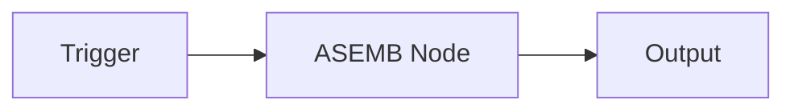
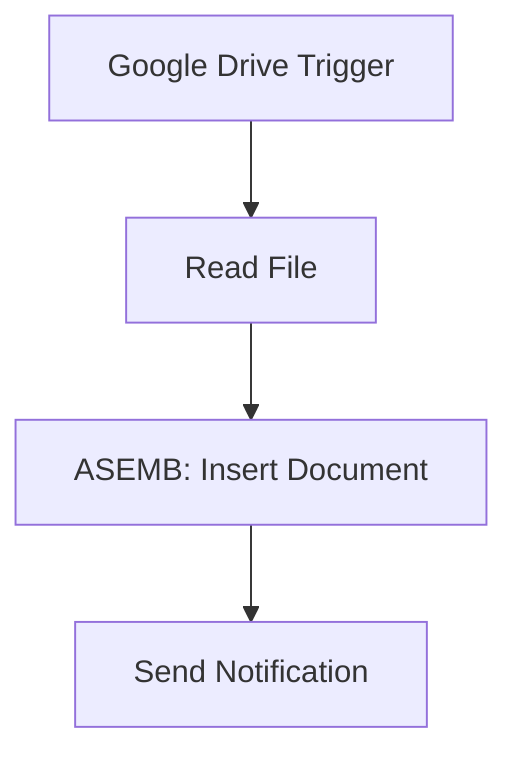
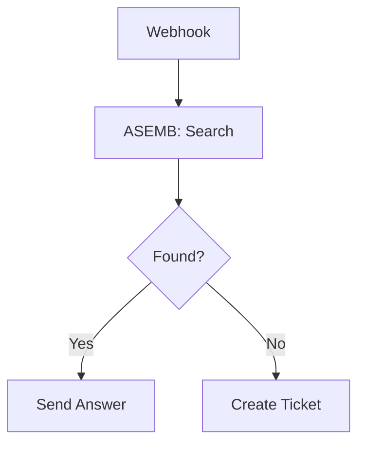
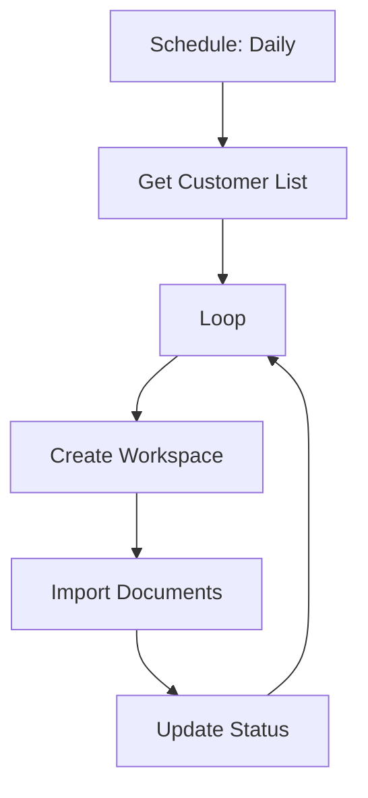
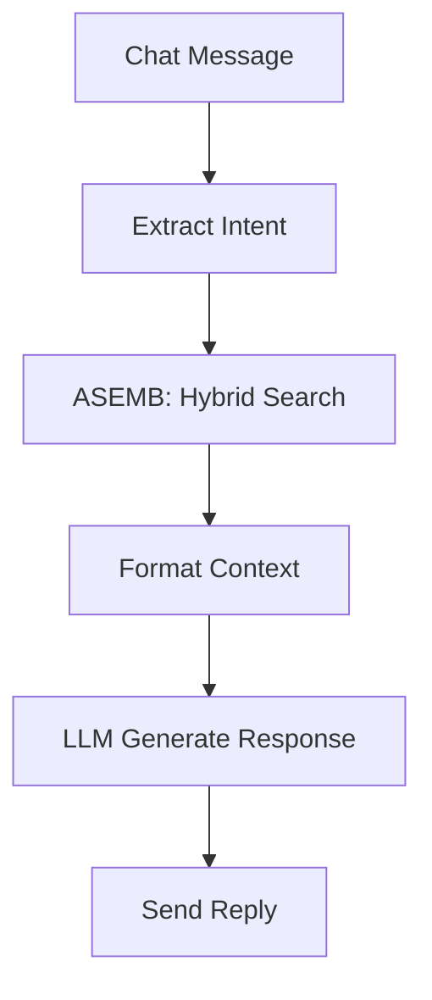

# ASEMB n8n Node User Guide

## Installation

### Method 1: npm Link (Development)
```bash
# In ASEMB directory
npm run build
npm link

# In n8n directory
npm link n8n-nodes-alice-semantic-bridge
n8n start
```

### Method 2: Community Nodes (Production)
1. Open n8n
2. Go to Settings → Community Nodes
3. Install: `n8n-nodes-alice-semantic-bridge`
4. Restart n8n

### Method 3: Docker
```bash
docker-compose --profile with-n8n up
```

## Configuration

### 1. Add Credentials

1. Go to Credentials → New
2. Select "ASEMB API"
3. Enter your configuration:
   - **API URL**: `http://localhost:8000/api/v1`
   - **API Key**: Your ASEMB API key
   - **Workspace ID**: Default workspace (e.g., `asemb_default_prod`)

## Basic Operations

### Document Management

#### Insert a Document


**Node Configuration:**
- **Operation**: Document
- **Action**: Insert
- **Workspace ID**: `{{ $credentials.workspaceId }}`
- **Content**: `{{ $json.content }}`
- **Metadata**: 
  ```json
  {
    "source": "{{ $json.source }}",
    "type": "{{ $json.type }}"
  }
  ```

#### Batch Insert Documents
Perfect for importing multiple documents:

```javascript
// Set node to "Execute Once" mode for batch
{
  "operation": "document",
  "action": "batchInsert",
  "documents": "{{ $json.documents }}",
  "options": {
    "chunkSize": 1024,
    "chunkOverlap": 128
  }
}
```

### Search Operations

#### Basic Semantic Search
```javascript
{
  "operation": "query",
  "action": "search",
  "query": "{{ $json.question }}",
  "limit": 10
}
```

#### Advanced Hybrid Search
```javascript
{
  "operation": "query",
  "action": "hybrid",
  "query": "{{ $json.query }}",
  "filters": {
    "metadata.type": "documentation",
    "created_after": "2024-01-01"
  },
  "options": {
    "includeChunks": true,
    "rerank": true
  }
}
```

### Workspace Management

#### Create Workspace
```javascript
{
  "operation": "workspace",
  "action": "create",
  "workspaceId": "asemb_{{ $json.customerId }}_{{ $json.environment }}",
  "config": {
    "llmProvider": "openai",
    "maxDocuments": 10000
  }
}
```

#### Switch Workspace
```javascript
{
  "operation": "workspace",
  "action": "switch",
  "workspaceId": "{{ $json.targetWorkspace }}"
}
```

## Example Workflows

### 1. Document Processing Pipeline



**Workflow JSON:**
```json
{
  "nodes": [
    {
      "type": "n8n-nodes-base.googleDriveTrigger",
      "name": "New File",
      "parameters": {
        "folderId": "your-folder-id"
      }
    },
    {
      "type": "n8n-nodes-alice-semantic-bridge.asemb",
      "name": "Store in ASEMB",
      "parameters": {
        "operation": "document",
        "action": "insert",
        "content": "={{ $json.content }}",
        "metadata": {
          "source": "google-drive",
          "filename": "={{ $json.name }}"
        }
      }
    }
  ]
}
```

### 2. Customer Support Bot



**Implementation:**
```javascript
// ASEMB Search Node
{
  "operation": "query",
  "action": "search",
  "workspaceId": "asemb_support_prod",
  "query": "={{ $json.body.question }}",
  "limit": 3
}

// IF Node
{
  "conditions": {
    "number": [
      {
        "value1": "={{ $json.results.length }}",
        "operation": "larger",
        "value2": 0
      }
    ]
  }
}
```

### 3. Multi-Tenant Document Sync



**Loop Configuration:**
```javascript
// For each customer
{
  "operation": "workspace",
  "action": "create",
  "workspaceId": "asemb_{{ $item.customerId }}_prod",
  "config": {
    "llmProvider": "{{ $item.llmPreference }}",
    "retention": "{{ $item.retentionDays }}"
  }
}
```

### 4. RAG-Powered Chatbot



**ASEMB Configuration:**
```javascript
{
  "operation": "query",
  "action": "hybrid",
  "query": "={{ $json.message }}",
  "mode": "hybrid",
  "limit": 5,
  "options": {
    "includeGraph": true,
    "expandQuery": true
  }
}
```

## Advanced Features

### Expression Functions

ASEMB adds custom expression functions:

```javascript
// Generate workspace ID
{{ $asemb.workspaceId('customer123', 'prod') }}
// Returns: asemb_customer123_prod

// Extract metadata
{{ $asemb.extractMetadata($json.document) }}

// Format for search
{{ $asemb.prepareQuery($json.userInput) }}
```

### Error Handling

```javascript
// Try-Catch pattern
{
  "nodes": [
    {
      "type": "n8n-nodes-asemb.asemb",
      "name": "ASEMB Operation",
      "continueOnFail": true
    },
    {
      "type": "n8n-nodes-base.if",
      "name": "Check Success",
      "parameters": {
        "conditions": {
          "string": [
            {
              "value1": "={{ $json.error }}",
              "operation": "isEmpty"
            }
          ]
        }
      }
    }
  ]
}
```

### Bulk Operations

```javascript
// Process multiple items efficiently
{
  "operation": "document",
  "action": "batchInsert",
  "batchSize": 100,
  "documents": "={{ $items }}",
  "parallel": true
}
```

### Caching Strategy

```javascript
// Use workspace-level caching
{
  "operation": "query",
  "action": "search",
  "options": {
    "cache": true,
    "cacheTTL": 3600
  }
}
```

## Best Practices

### 1. Workspace Organization
```
asemb_{customer}_{environment}_{purpose}

Examples:
- asemb_acme_prod_support
- asemb_acme_dev_testing
- asemb_internal_prod_kb
```

### 2. Metadata Standards
```json
{
  "source": "system|user|api",
  "type": "document|faq|guide",
  "version": "1.0.0",
  "tags": ["tag1", "tag2"],
  "created_by": "user_id",
  "department": "engineering"
}
```

### 3. Performance Optimization
- Use batch operations for > 10 documents
- Enable caching for repeated queries
- Set appropriate chunk sizes (512-2048)
- Use filters to narrow search scope

### 4. Security
- Never expose API keys in workflows
- Use credentials, not hardcoded values
- Implement workspace-level access control
- Audit sensitive operations

## Troubleshooting

### Common Issues

#### "Workspace not found"
```javascript
// Check workspace exists
{
  "operation": "workspace",
  "action": "get",
  "workspaceId": "{{ $credentials.workspaceId }}"
}
```

#### "Rate limit exceeded"
Add delay between operations:
```javascript
{
  "type": "n8n-nodes-base.wait",
  "parameters": {
    "amount": 1,
    "unit": "seconds"
  }
}
```

#### "Document too large"
Split large documents:
```javascript
{
  "operation": "document",
  "action": "insert",
  "options": {
    "autoChunk": true,
    "maxChunkSize": 1024
  }
}
```

### Debug Mode

Enable detailed logging:
```javascript
{
  "operation": "query",
  "action": "search",
  "options": {
    "debug": true,
    "explain": true
  }
}
```

## Integration Examples

### With OpenAI
```javascript
// Use ASEMB results as context
{
  "type": "n8n-nodes-base.openAi",
  "parameters": {
    "prompt": "Answer based on context: {{ $json.results }}",
    "model": "gpt-4"
  }
}
```

### With Slack
```javascript
// Post search results to Slack
{
  "type": "n8n-nodes-base.slack",
  "parameters": {
    "channel": "#support",
    "text": "Found {{ $json.results.length }} relevant documents",
    "attachments": "={{ $json.results }}"
  }
}
```

### With Database
```javascript
// Store search analytics
{
  "type": "n8n-nodes-base.postgres",
  "parameters": {
    "operation": "insert",
    "table": "search_logs",
    "columns": "query,results,timestamp",
    "values": "={{ $json.query }},={{ $json.results }},={{ new Date() }}"
  }
}
```

## Resources

- [API Documentation](./api.md)
- [Example Workflows](../examples/)
- [Video Tutorials](https://youtube.com/asemb)
- [Community Forum](https://community.n8n.io/c/nodes/asemb)
