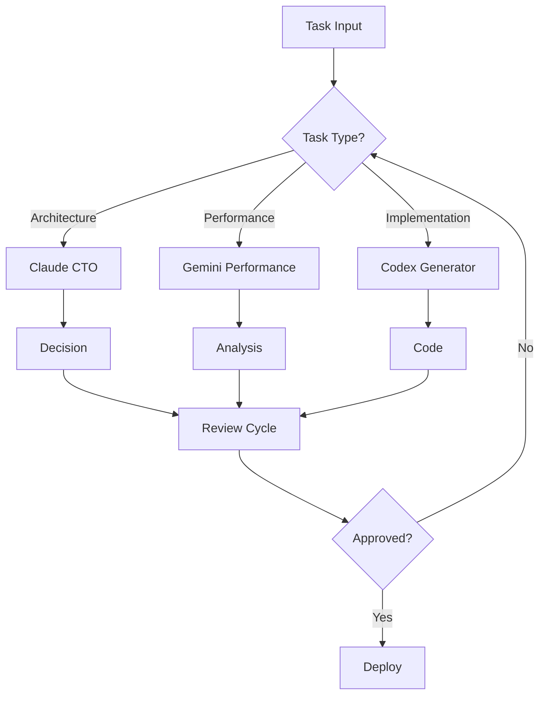

# AI Agent Orchestration Configuration
# Master configuration for all AI agents

## Agent Roles & Responsibilities

### Claude (CTO)
- **Primary**: Architecture, Security, Code Review
- **Decision Authority**: Framework selection, API design, Security policies
- **Veto Power**: Can block any code that doesn't meet standards

### Gemini (Performance Specialist)
- **Primary**: Optimization, Algorithms, Performance
- **Analysis**: Complexity analysis, Bottleneck detection
- **Recommendations**: Algorithm improvements, Caching strategies

### Codex (Code Generator)
- **Primary**: Code generation, Documentation, Examples
- **Automation**: Boilerplate code, Test generation, API docs
- **Standards**: Follow Claude's architectural decisions

## Collaboration Workflow

## Communication Protocol

1. **Task Assignment**
   - Claude assigns tasks based on expertise
   - Gemini handles performance-critical paths
   - Codex implements approved designs

2. **Review Process**
   - Codex generates → Claude reviews → Gemini optimizes
   - All performance-critical code reviewed by Gemini
   - Security-sensitive code reviewed by Claude

3. **Conflict Resolution**
   - Performance vs Security: Claude decides
   - Complexity vs Simplicity: Team consensus
   - Time vs Quality: Project manager input

## Integration Points

- **Code Reviews**: Claude must approve all PRs
- **Performance Gates**: Gemini sets performance criteria
- **Documentation**: Codex maintains all docs
- **Monitoring**: All agents monitor their domains

## Success Metrics

- Code Quality Score > 90%
- Performance Benchmarks Met
- Documentation Coverage > 95%
- Security Vulnerabilities = 0
- Development Velocity Maintained
